## LensLog - FE

### 스팩

### 구현 기능

- 메인 화면
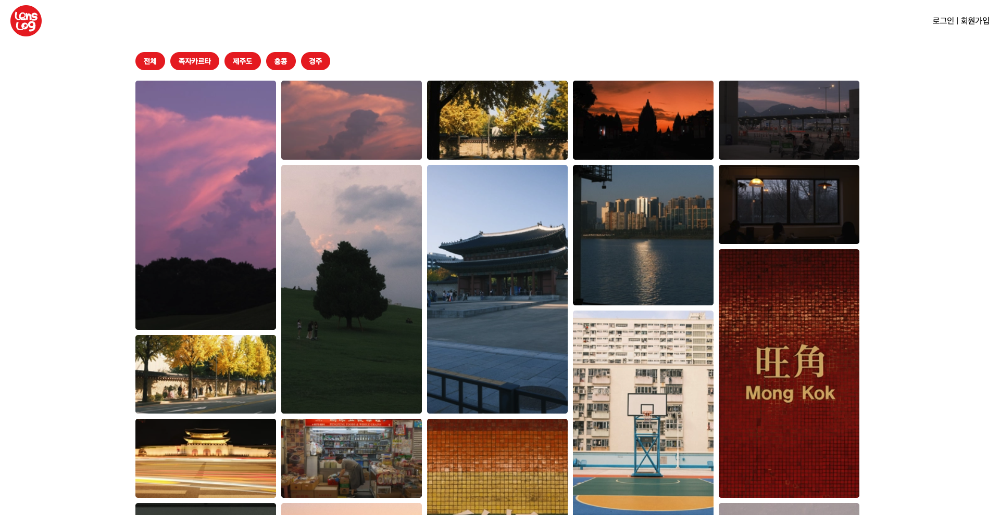

- 상세 페이지 화면(세로 버전, 가로 버전)
    - 상세 페이지 세로
    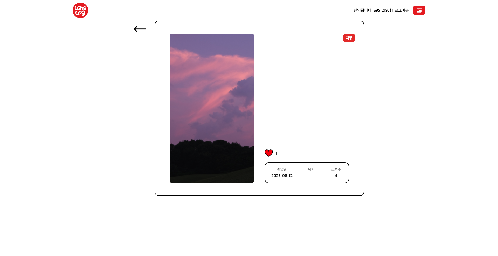

    - 상세 페이지 가로
    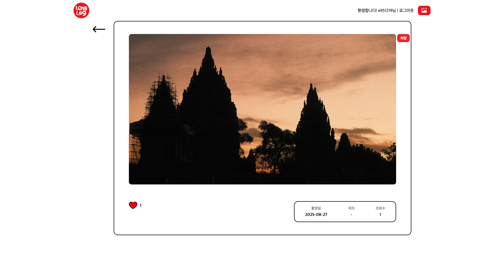

- 회원가입 화면

- 회원가입 완료 화면
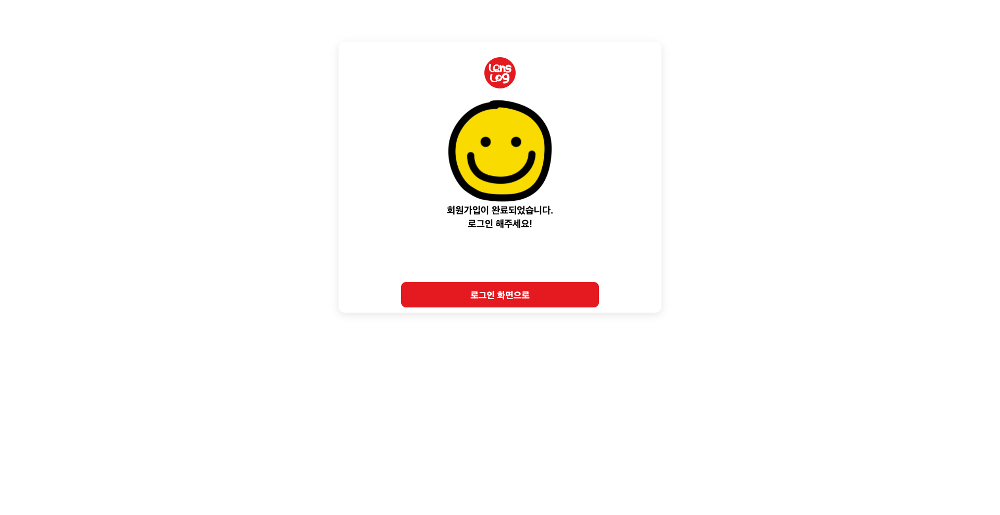

- 로그인 화면
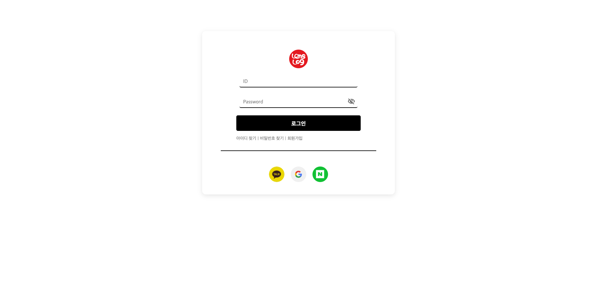

- 아이디 찾기 화면
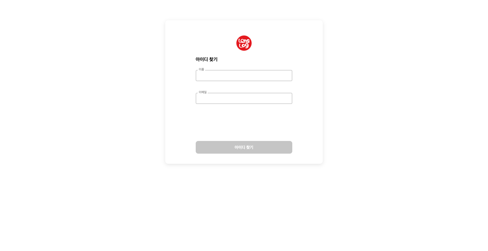

- 아이디 찾기 결과 화면
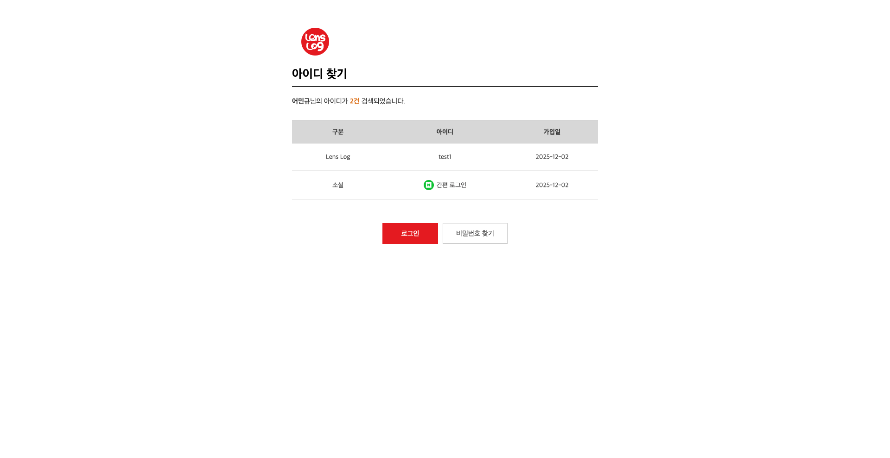

- 비밀번호 찾기 화면
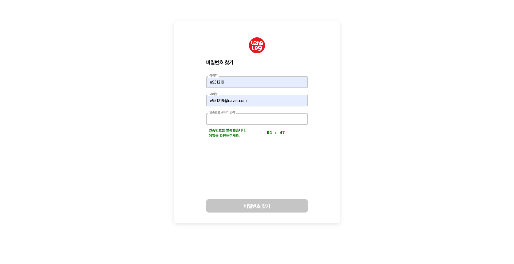

- 비밀번호 변경 화면
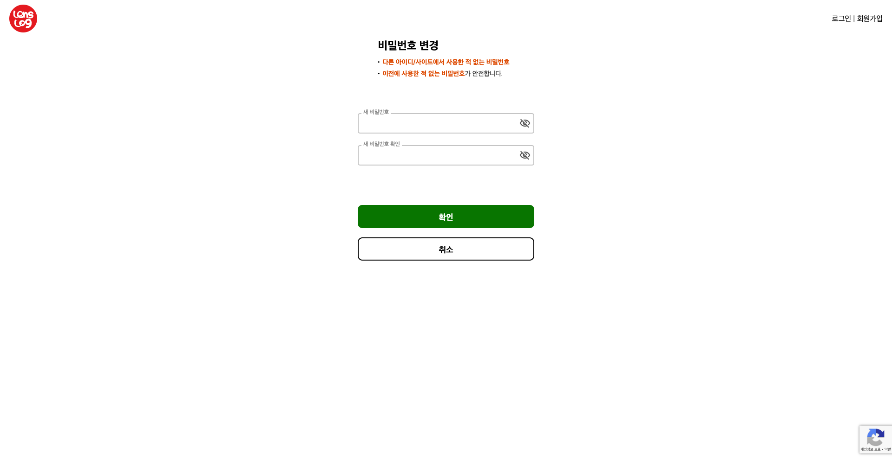

- 비밀번호 변경완료 화면

- 이미지 업로드 화면(관리자용)
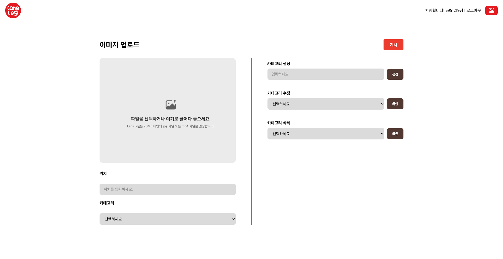

- 로그인 안내 모달 화면
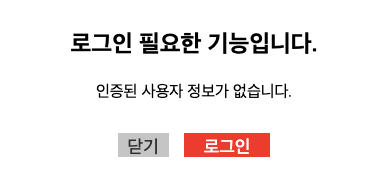

- 로그아웃 안내 모달 화면
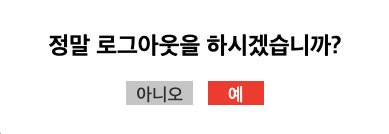